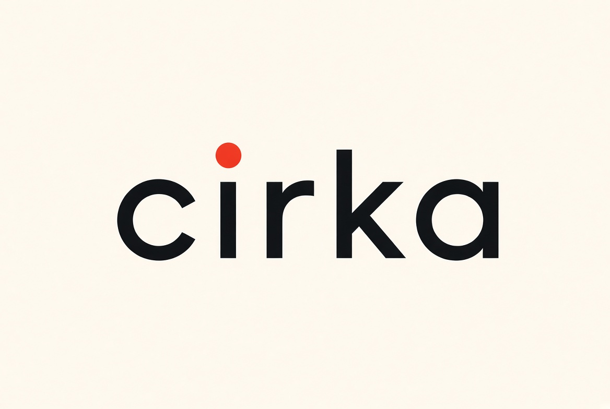

<p align="center"></p>

# cirka

端末の作業ディレクトリで動く、コーディング用の CUI エージェントです。Claude Code と同じく、モデルが「次のツール呼び出し」か「最終回答」を返し、cirka がそのツールを **cirka を起動した PC の上で** 実行して結果を返す、を繰り返します。

モデルは、LAN 上のホスト（[local-agent](../README.md)）の llama.cpp（ルータ）で動く 27B です。cirka はホストの LangGraph に `POST /coder/turn` で 1 ターンずつ推論を頼むだけで、LLM サーバ・ComfyUI・Tor へ直接はつなぎません。ホストはツールを実行せず、会話も保存しません（履歴は cirka のセッションファイルが持ちます）。

このディレクトリ（`client/`）が cirka のソースです（Rust、単一バイナリ）。設計は [docs/locus-cui-design.md](../docs/locus-cui-design.md)（設計時の作業名は locus）にあります。

```
利用者の PC                                   ホスト（local-agent）
cirka ── ファイル操作・コマンド（手元で実行）
  │
  ├── POST /coder/turn（推論 1 ターン）─────▶ LangGraph :2024 ──▶ llama.cpp ルータ（ループバック）
  └── POST /runs/stream（検索・画像）──────▶ LangGraph :2024 ──▶ Tor 検索 / ComfyUI
```

## 必要なもの

- ホスト: local-agent v0.7.0 以降（`/coder/turn` があること）が起動していて、この PC から `http://<ホストの LAN IP>:2024` に届くこと。
- 実行: Windows / macOS / Linux。ビルド済みの `cirka`（`cirka.exe`）だけで動きます（grep もファイル検索も内蔵）。
- ビルドする場合: Rust 1.85 以上（`winget install Rustlang.Rustup` など）。

## ビルドとインストール

```powershell
# リポジトリのルートで（Windows）: client\target\release\cirka.exe と dist\cirka-<版>-windows-<CPU>.zip を作る
.\scripts\build-cirka.ps1

# どの OS でも
cd client
cargo build --release        # target/release/cirka（Windows は cirka.exe）
```

できた実行ファイルを PATH の通った場所に置きます。

## 接続先の設定

既定の接続先は `http://127.0.0.1:2024`（ホストと同じ PC）です。別の PC から使うときは、ホストの LAN アドレスを設定します。

```powershell
cirka config set host http://192.168.1.20:2024        # ユーザー設定に保存
cirka config set host http://gpu-box:2024 --project   # このディレクトリだけ（./.cirka/config.toml）
cirka config show                                     # 実際に使われる値と、読み込んだ場所
cirka status                                          # ホストに届くか、ゲート、ホストの LLM、モデル、文脈の大きさ
```

実行中に `/host http://… [--save]` でも切り替えられます。

## 使い方

```
$ cd ~/src/some-project
$ cirka                          # 対話
$ cirka -p "テストが落ちる原因を調べて直して"   # 1 回だけ実行して終わる
$ cirka --resume                 # このディレクトリの直前のセッションを再開
$ cirka logo                     # ロゴを表示
```

起動したディレクトリがワークスペースの根になります。`CIRKA.md` / `AGENTS.md` / `CLAUDE.md` があれば、プロジェクトの規則として読みます（各 16 KiB まで、文脈に合わせて切り詰め）。複数の手順が要る依頼では、モデルがまずタスク一覧を作り、探索 → 編集 → コマンドでの確認、の順に進めます。短い質問はそのまま答えます。

### ツール

| ツール | 内容 |
|---|---|
| `list_dir` / `glob` / `grep` / `read_file` | 一覧、パターン検索、正規表現検索（`.gitignore` と `.cirkaignore` に従う）、行番号付きの読み取り |
| `edit_file` | 一意に一致する原文を置き換える。先に `read_file` したファイルだけ。CRLF を保つ |
| `write_file` | 新規作成、または読んだファイルの置き換え |
| `bash` | シェルのコマンド（Windows は PowerShell 7 があれば `pwsh`、なければ Windows PowerShell。ほかは `sh -lc`）。出力 64 KiB まで。止めるときはプロセスツリーごと |
| `todo_write` / `ask_user` | タスク一覧、利用者への質問 |
| `web_search` | ホストのチャットタブの検索（Tor 経由、出典付き） |
| `image_generate` | ホストの画像タブ（参照画像 0〜4 枚と役割）。画像はワークスペースの `cirka-outputs/` に保存し、モデルにはパスだけを渡す |

### 許可モード

入力欄の下に今のモードが出ます。Shift+Tab で auto → 確認 → 編集は自動 → plan の順に切り替わり、`/auto` などのコマンドや `--permission`、設定の `permission` でも変えられます。

| モード | 編集 | コマンド |
|---|---|---|
| `auto`（既定） | 確認なし | 確認なし。ただし取り返しのつかない操作や外へ出る操作（git push / reset --hard / clean -f、再帰的な削除、`curl … \| sh` のようなダウンロードの即実行、sudo、npm / cargo publish、ディスク・電源・レジストリの操作など）だけは確認する |
| `default` | 差分を見せて確認 | 全文を見せて確認 |
| `accept-edits` | 確認なし | 確認 |
| `plan` | 実行しない（提案だけ） | 実行しない |
| `bypass` | 確認なし | 危険な操作も確認なし（シェルと同じ権限。`--permission bypass` で明示したときだけ） |

確認は矢印キー（または数字）で選ぶメニューです: はい / はい、以後このセッションでは確認しない / いいえ（理由がモデルに伝わる）/ 依頼を止める（Esc）。`-p` の 1 回実行は対話できないので、確認が要る操作は実行しません。

どのモードでも、ワークスペースの外のパス（`..`、外を指すシンボリックリンク）と秘密ファイル（`.env`、`*.pem`、`*.key`、`id_rsa`、`credentials*` など）は扱いません。ツールの結果に鍵らしい文字列があれば `[redacted]` にしてからホストへ送ります（完全ではありません）。

### 画面とキー

Claude Code に倣った画面です。

- 起動すると、ロゴ（[docs/logo](../docs/logo) の画像から作った端末用の絵）と、作業ディレクトリ・接続先・モデルを枠の中に出します。
- 入力欄: Enter で送信、Shift+Enter / Alt+Enter / 行末の `\` で改行、↑↓ で履歴、Tab でコマンド補完、Esc で入力を消す、Ctrl-C で入力を消す（空なら 2 回で終了）。貼り付けた複数行はそのまま入ります。
- 応答は `⏺` で始まるブロック、ツール呼び出しは `⏺ Read(src/main.rs)` のような 1 行、結果は `⎿` の下に短く出ます。編集は行番号付きの色付き差分、タスク一覧は ☐ / ◼ / ☒ で出します。
- 待っているあいだは経過秒数付きのスピナーが回ります。実行中の応答やツールは Ctrl-C で止めます。

### スラッシュコマンド

| コマンド | 動作 |
|---|---|
| `/help` | ヘルプ |
| `/status` | 接続先、モデル、モード、許可、タスク |
| `/host [URL] [--save]` | 接続先を表示 / 変更（`--save` でユーザー設定に保存） |
| `/mode fast\|think\|auto` | ホストの思考の使い方 |
| `/auto` `/default` `/accept-edits` `/plan` | 許可モード |
| `/cd <path>` | ワークスペースを変える（確認あり） |
| `/undo` | 直前のエージェントの編集を戻す（新規作成なら削除） |
| `/compact` | 会話を要約して文脈を空ける |
| `/search <q>` / `/image <指示>` | ホストの検索 / 画像生成を直接使う |
| `/todos` | タスク一覧 |
| `/resume` / `/forget` | このディレクトリの直前のセッションを再開 / いまのセッションのログを消す |
| `/logo` / `/clear` | ロゴを表示 / 画面を消してウェルカム画面を出し直す |
| `/quit` | 終了 |

## 設定

設定は次の順に重ねて読み、後のものが勝ちます。

1. 既定値
2. ユーザー設定: Windows は `%APPDATA%\cirka\config.toml`、macOS / Linux は `$XDG_CONFIG_HOME/cirka/config.toml`（なければ `~/.config/cirka/config.toml`）
3. プロジェクト設定: `<作業ディレクトリ>/.cirka/config.toml`
4. 環境変数: `CIRKA_HOST`、`CIRKA_MODE`、`CIRKA_PERMISSION`、`CIRKA_AUTH_HEADER`、`CIRKA_IDLE_TIMEOUT_S`
5. コマンドライン: `--host`、`--mode`、`--permission`、`--max-turns`

| キー | 既定 | 内容 |
|---|---|---|
| `host` | `http://127.0.0.1:2024` | ホスト（local-agent の LangGraph）の URL |
| `mode` | `auto` | `fast` / `think` / `auto`。ホストの思考トークンの使い方 |
| `permission` | `auto` | `auto` / `default` / `accept-edits` / `plan` / `bypass` |
| `shell` | `auto` | `auto` / `pwsh` / `powershell` / `cmd` / `bash` / `sh` |
| `max_turns` | `40` | 1 つの依頼で回すモデルのターン数の上限 |
| `locale` | `ja` | 応答の言語（利用者が別の言語で書けばそれに合わせる） |
| `auth_header` | 空 | `Name: value`。設定すると全リクエストに付ける（ホストに認証はまだ無く、差し込み口だけ） |
| `idle_timeout_s` | `1200` | **何も返ってこない時間の上限（秒）**。下の「タイムアウト」 |

例（`%APPDATA%\cirka\config.toml`）:

```toml
host = "http://192.168.1.20:2024"
permission = "auto"
idle_timeout_s = 1800
```

## タイムアウト

cirka は「何も返ってこない時間」だけで打ち切ります。何かが返ってきている限り、全体にかかる時間では打ち切りません。手元の小さな PC で 27B を動かす都合上、1 回の応答に何分もかかることがあるためです。上限は `idle_timeout_s`（既定 1200 秒 = 20 分）で変えられます。

| 待つもの | 「返ってきている」とみなすもの |
|---|---|
| モデルの応答（`/coder/turn`） | トークン、思考トークン、ホストが別の処理を待っているあいだの状態通知（5 秒ごと） |
| ホストの検索・画像生成（`/runs/stream`） | ホストから届くストリームのすべてのデータ（進捗の更新） |
| `bash` のコマンド | 標準出力・標準エラーへの出力。モデルは `timeout_s` で、これより短い「無出力の上限」を指定できる |

ホスト側の待ち時間も同じ考え方で、`.env` の `AGENT_IDLE_TIMEOUT_S`（既定 1200 秒）で変えます（[README のタイムアウト](../README.md)）。

## ファイルの置き場

| 場所 | 中身 |
|---|---|
| `%LOCALAPPDATA%\cirka\sessions\`（macOS / Linux は `~/.local/share/cirka/sessions/`） | セッション（JSON Lines。ツールの結果を含む。`/forget` で削除） |
| `<作業ディレクトリ>/cirka-outputs/` | `image_generate` で作った画像 |
| `<作業ディレクトリ>/.cirkaignore` | 検索・一覧から外すパス（`.gitignore` と同じ書き方） |
| `<作業ディレクトリ>/CIRKA.md` | cirka 向けのプロジェクト規則（任意） |

## 注意

- ホストの 27B は context 4096 トークンです。cirka は毎ターン、規則・環境・タスク一覧・会話をこの窓に収めます（古いツール結果は 1 行の要約にし、さらに溢れたら古いやり取りから省きます）。依頼は小さく区切ってください。`/compact` で会話を要約できます。
- ホストの処理は画像タブ・チャットタブと共有のロックで 1 つずつ進みます。ほかの処理が動いているあいだ、cirka は「待っています」と表示して待ちます。
- 認証はありません。読んだファイルの断片とコマンドの出力が LAN 上のホストへ送られます。信頼できるネットワークだけで使ってください。
- `bash` は OS のサンドボックスなしで、この PC の上で動きます。既定の auto では確認なしで実行するので、信頼できないリポジトリでは `/default` か `/plan` にしてください。

## トラブルシューティング

| 症状 | 対処 |
|---|---|
| 「ホストに届きません」 | `cirka status` で確認。`cirka config set host http://<LAN IP>:2024`（`localhost` は cirka を動かす PC 自身）。ホスト側の LangGraph の起動とファイアウォール（`scripts\open-firewall.ps1`）を確認 |
| 「ホストに /coder/turn がありません」 | ホストの local-agent が v0.7.0 より古い。更新して LangGraph を再起動する |
| 「… の処理を待っています」のまま | 画像タブやチャットタブが動いている。終われば自動で進む |
| 「N 秒間応答がありません」 | ホストか、ホストの LLM（llama.cpp ルータ）が止まっている可能性。`cirka status` で確認。重い処理で本当に長く無音になるなら `idle_timeout_s` を増やす |
| 「文脈が溢れました」 | `/compact`、または依頼を小さくする |
| ロゴや枠が崩れる・色が出ない | Windows Terminal など UTF-8 と 24 ビット色の使える端末で開く。色を消すなら `NO_COLOR=1`。端末が狭いと文字だけのロゴになる |

## 開発

```powershell
cd client
cargo test              # ホストは立てない（モデルは台本、端末は偽物で試す）
cargo clippy
```

| ファイル | 役割 |
|---|---|
| `src/main.rs` | 引数、`config` / `status` / `logo` サブコマンド |
| `src/app.rs` | REPL、スラッシュコマンド |
| `src/agent.rs` | エージェントループ（UI とホストから切り離した純ロジック） |
| `src/host.rs` | `/coder/turn` と `/runs/stream` のクライアント（SSE） |
| `src/context.rs` | 毎ターンのプロンプトの組み立てと文脈への収め方 |
| `src/policy.rs` | 許可モードと auto で確認する操作の一覧 |
| `src/tools/` | ツール（`fs`、`grep`、`bash`、`todo`、`remote`） |
| `src/workspace.rs` | ワークスペースの境界、秘密ファイル、伏せ字 |
| `src/session.rs` | セッションの記録と再開 |
| `src/tui.rs`、`src/ui.rs` | 画面と、ループから見た UI の境界 |
| `src/art.rs`、`src/art_data.rs` | ロゴの描画（`art_data.rs` は `scripts/gen_cirka_art.py` が `docs/logo` から作る生成物） |

ロゴを差し替えたら、リポジトリのルートで `uv run python scripts/gen_cirka_art.py`（`--preview artifacts/cirka-art.png` で確認用の画像）を実行してからビルドし直します。

## ライセンス

MIT または Apache-2.0（リポジトリの [LICENSE-MIT](../LICENSE-MIT)、[LICENSE-APACHE](../LICENSE-APACHE)）。
