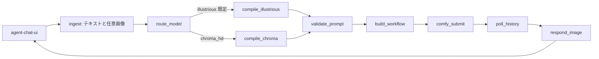

# Chroma HD 対応 作業指示書

対象: 既存の LangGraph + ComfyUI + LM Studio 画像生成アプリへ、Flux.1 由来の Chroma1-HD を追加する。
読者: 実装を担当する別の AI、または実装者。
方針: 既存の yiffinhell（Illustrious 系タグ生成）経路はデフォルトのまま残し、モデルファミリを明示選択できる分岐を足す。推測で既存グラフを書き換えない。

作成日: 2026-10-04
ステータス: 設計確定前の作業指示。第 2 章の事前確認が埋まるまで、ComfyUI ワークフロー JSON のノード名をハードコードして本番接続しない。

---

## 1. この文書の使い方

1. 第 2 章の事前確認を、対象リポジトリと稼働中の ComfyUI に対して実施し、空欄を埋める。
2. 埋まらない項目は実装しない。特に ControlNet は「動く前提」で結線しない。
3. 第 6 章の設計に従い、第 7 章のフェーズ順で変更する。
4. 既存 yiffinhell 経路のリクエスト/レスポンス契約を壊したら不合格。
5. 実装後、第 8 章の受け入れ基準をすべて満たすこと。

この文書は実装の単一情報源ではない。単一情報源は対象リポジトリの現行コードと、稼働中 ComfyUI から export した API-format workflow JSON である。文書とコードが矛盾したらコードと export JSON を優先し、差分をこの文書へ追記する。

---

## 2. 事前確認

実装 AI は編集前に以下を調査し、結果をこの節へ箇条書きで残す。未確認のままワークフロー JSON を書かない。

### 2.1 リポジトリ

確認すること:

- LangGraph のエントリ（`StateGraph` 定義ファイル、state schema、ノード一覧）。
- 日本語プロンプトを受け、LM Studio の Qwen 3.8 27B abliterated を呼ぶノード名と、システムプロンプトの所在。
- ComfyUI へ投入しているワークフローの所在（埋め込み dict / JSON ファイル / API で都度組み立て）。
- 画像の返し方。`agent-chat-ui` が既に表示できている形式（markdown 画像、`image_url` content block、artifact、カスタムメッセージ）をそのまま使う。新しい表示プロトコルを発明しない。
- 他ホストのブラウザから到達する公開境界（LangGraph の host/port、CORS、画像 URL が `localhost` になっていないか）。
- ControlNet の現行実装。プリプロセッサ名、モデルファイル名、強度、開始/終了 step、入力画像の受け渡し（chat 添付 / 別 API / ComfyUI input ディレクトリ）。

記録テンプレート:

```text
graph entry:
state fields:
llm node:
comfy submit node:
workflow source:
image response contract:
controlnet path:
public base url for images:
```

### 2.2 稼働ホスト

確認すること:

- 画像生成 GPU の VRAM。12GB 以下なら Chroma1-HD BF16（約 17.8GB）は載らない。GGUF か FP8 を前提にする。
- ComfyUI の版と、`UNETLoader` / `UnetLoaderGGUF` / `VAELoader` / `CLIPLoader`（type=flux または t5）が存在するか。
- カスタムノード: `ComfyUI-GGUF`（city96）。Chroma の現行 ComfyUI では FluxMod は非必須。README の古い「ComfyUI_FluxMod 必須」記述は現行 Chroma1-HD 経路では採用しない。
- モデルファイルの実パスとファイル名。フォルダは ComfyUI 版により `models/diffusion_models` と `models/unet`、`models/text_encoders` と `models/clip` が分かれる。存在する側を使う。
- yiffinhell チェックポイント名、VAE、使用中 ControlNet ファイル名。
- ComfyUI が `--listen` で他ホストから叩かれているか。画像返却 URL がその listen アドレスと一致するか。

推奨配置（存在する側に合わせる）:

| 役割 | ファイル | 置き場所 |
| --- | --- | --- |
| Chroma1-HD 本体 | `Chroma1-HD.safetensors` または `Chroma1-HD-Q4_K_M.gguf` / `Q5_K_M` / `Q8_0` | `models/diffusion_models` または `models/unet` |
| テキストエンコーダ | `t5xxl_fp16.safetensors` または `t5xxl_fp8_e4m3fn.safetensors`。12GB 級は fp8 または T5 GGUF | `models/text_encoders`（無ければ `models/clip`） |
| VAE | Flux 系 `ae.safetensors` | `models/vae` |
| 公式ワークフロー参照 | `ComfyUI_Chroma1-HD_T2I-workflow.json` | リポジトリの `workflows/reference/` に保存し、API 形式へ変換する |

取得元:

- モデルカード: https://huggingface.co/lodestones/Chroma1-HD
- 公式 T2I workflow JSON: https://huggingface.co/lodestones/Chroma1-HD/resolve/main/ComfyUI_Chroma1-HD_T2I-workflow.json
- T5: https://huggingface.co/comfyanonymous/flux_text_encoders
- GGUF 変換例: https://huggingface.co/silveroxides/Chroma1-HD-GGUF
- ライセンス: Apache-2.0

VRAM の初期選択:

| GPU | 初期選択 | 備考 |
| --- | --- | --- |
| 24GB 以上 | BF16 diffusion model + T5 fp8 または fp16 | 品質優先 |
| 16GB | Q8_0 または FP8 scaled + T5 fp8 | 解像度 1024 付近から試す |
| 12GB | Q5_K_M または Q4_K_M + T5 fp8/GGUF、VAE は都度ロード | 1152 四方はピーク超過しやすい。初期解像度は 896 または 1024 |
| 8GB 以下 | 本対応の対象外。実装しない | offload しても実用にならない前提で止める |

量子化サイズの目安（重みのみ。推論ピークは解像度と latent で増える）: Q4_K_M 約 5.6GB、Q5_K_M 約 6.7GB、Q8_0 約 9.7GB、BF16 約 17.8GB。VAE 約 0.3GB。T5 fp16 は約 9.5GB なので 12GB カードでは T5 を fp8 または GGUF にする。

### 2.3 公式グラフから写すノード

公式 JSON を ComfyUI に読み、API format（`/object_info` と Save (API Format)）で export する。実装に使うノード名は export 結果だけを正とする。想定は次のとおりで、名前が違えば export 側に合わせる。

- diffusion model: `UNETLoader` または GGUF の `UnetLoaderGGUF`
- text encoder: `CLIPLoader`（type を flux / t5 系にする。SDXL の `DualCLIPLoader` ではない）
- 正負プロンプト: `CLIPTextEncode` を 2 つ。Flux Dev の `CLIPTextEncodeFlux` や `FluxGuidance` を、公式 JSON が使っていないなら追加しない
- latent: `EmptySD3LatentImage` または公式 JSON が使っている latent ノード。SDXL の `EmptyLatentImage` を流用しない
- サンプル: `KSampler`。初期値は公式 workflow の euler / beta / 26 steps / CFG 3.8 を起点にし、モデルカード例の 40 steps / guidance 3.0 は品質比較用プリセットに分ける
- decode: `VAEDecode` + `SaveImage`
- 負プロンプトは空にしない。Chroma は蒸留解除済みで負条件を使う。Flux Schnell の「CFG=1、負プロンプト無し」を適用しない

### 2.4 ControlNet の事前実験（実装前に 1 枚）

Chroma1-HD は Flux.1-schnell 系を改変した 8.9B で、modulation 層を削っている。Shakker / InstantX の `FLUX.1-dev-ControlNet-Union-Pro` および Union Pro 2.0 は Flux Dev 向けであり、Chroma での一致は保証されない。

実装前に、公式 T2I グラフへ次を 1 本だけ足して手動実行する。

- `ControlNetLoader` に Union Pro（可能なら 2.0）
- `SetUnionControlNetType`（KJNodes 等、既存ノードにあるもの）で `openpose`
- `DWPreprocessor` または既存の pose 抽出
- `ControlNetApplyAdvanced`
- strength 0.6、start 0.0、end 0.7 を初期値

判定:

- ポーズが参照に追従する: ControlNet 経路を有効機能にする
- ノイズ、部位崩壊、無視: ControlNet は experimental フラグの裏に置き、既定はオフ。ポーズは img2img（denoise 0.55–0.75）を代替にする
- ノードが型エラー: その ComfyUI 版では未対応と記録し、UI に「Chroma ではポーズ指定不可」と出す

画風参照も同様。Flux Redux / IP-Adapter は Chroma 非対応の可能性が高い。既定の画風指定は自然言語の画風記述とし、参照画像は「任意の低 denoise img2img」に限る。

---

## 3. 現状と差分

現行（コード確認前の理解。第 2 章で訂正する）:

- 利用者は他ホストのブラウザから `agent-chat-ui` 経由で日本語プロンプトを送る。
- LangGraph が LM Studio 上の Qwen 3.8 27B abliterated に、画像生成用タグを作らせる。
- ComfyUI が yiffinhell（Illustrious ベース）で画像を作り、チャット応答へ返す。
- 入力画像でポーズや画風を指定でき、SDXL / Illustrious 向け ControlNet を使う。

yiffinhell は Danbooru / e621 系タグ、品質タグ、重み構文、負プロンプトが有効な SDXL チェックポイント経路。Chroma1-HD は T5-XXL に自然文を渡す diffusion-model 経路。同じ文字列を両モデルへ流すと品質が落ちる。LLM 段でファミリ別コンパイルが必要。

| 項目 | yiffinhell（維持） | Chroma1-HD（追加） |
| --- | --- | --- |
| 系統 | Illustrious / SDXL checkpoint | Flux.1-schnell 改変、8.9B、Apache-2.0 |
| ローダ | `CheckpointLoaderSimple` | `UNETLoader` または `UnetLoaderGGUF` + `VAELoader` + T5 `CLIPLoader` |
| テキスト | CLIP-L + CLIP-G、タグ列 | T5-XXL、英語の記述文。タグの羅列はノイズになりやすい |
| 重み構文 | `(tag:1.2)` 可 | 使わない。強調は "with emphasis on" 等の文 |
| 品質タグ | `masterpiece, best quality` 等が有効 | `masterpiece` / `8k` / `best quality` は入れない |
| 負プロンプト | 長めの品質・解剖ネガティブが有効 | 短く使う。空にはしない |
| CFG | 現行値を維持（目安 4.5 前後） | 3.0–4.0。初期 3.5。Flux Schnell の CFG 1 は使わない |
| steps / sampler | 現行値を維持 | 初期 euler / beta / 28 steps。比較用に 40 steps |
| 解像度 | 現行（512–1536 サポートの報告あり） | 初期 1024x1024。16 の倍数。12GB は 1152 を既定にしない |
| 特殊トークン | Danbooru タグ、`anthro` 等 | 任意で `aesthetic 7` から `aesthetic 10`。必須ではない |
| ControlNet | 現行 SDXL ControlNet を維持 | Union Pro は実験。未確認なら無効 |
| 既定 | 既定モデルのまま | 明示選択時のみ |

---

## 4. 要件

必須:

- モデル選択なしの既存リクエストは、現行と同じ yiffinhell 経路・同じタグコンパイル・同じ ControlNet 挙動になる。
- 利用者が `chroma` / `chroma_hd` を選んだときだけ Chroma 経路に入る。
- 日本語入力を、ファミリ別システムプロンプトで LLM がコンパイルする。Chroma の出力は英語の自然文で、タグ列にしない。
- 生成画像を、現行と同じ契約で `agent-chat-ui` に返す。画像 URL は生成ホストの localhost ではなく、ブラウザが到達できる基底 URL にする。
- 参照画像がある場合、ファミリごとに対応範囲を分ける。未対応の組み合わせは黙って無視せず、応答テキストで理由を返す。
- ワークフロー JSON、sampler 初期値、モデルファイル名はコードへ直書きせず設定ファイルへ出す。
- 失敗時（ComfyUI 切断、モデル未配置、OOM、LLM の不正出力）は画像なしで理由を返し、グラフをクラッシュさせない。

任意（事前実験が成功した場合のみ）:

- Chroma の openpose / depth / canny。
- Chroma の参照画像 img2img。

非目標:

- yiffinhell チェックポイントの差し替え、既存タグ辞書の整理。
- Flux Dev 本家や SD3 への一般化。ファミリ追加点は `illustrious` と `chroma_hd` の 2 つのみ。
- プロンプトの自動翻訳を ComfyUI カスタムノード側で行うこと。コンパイルは LangGraph の既存 LLM ノードに寄せる。
- 12GB 未満 GPU への対応、複数同時生成のキューイング最適化。
- Chroma 用 LoRA の学習。

---

## 5. 設計

### 5.1 グラフ



ノード追加は最小にする。現行が 1 つの compile ノードなら、その中でファミリ分岐してよい。現行の Comfy 投入ノードがワークフロー dict を受け取っているなら、dict の組み立てだけをファミリ分岐する。グラフの辺を増やして既存のチェックポイント処理をコピーしない。

### 5.2 状態

既存 state に次を追加する。既存フィールドの意味は変えない。

```text
model_family: "illustrious" | "chroma_hd"     # 既定 illustrious
compiled_positive: str
compiled_negative: str
control_mode: "none" | "pose" | "canny" | "depth" | "img2img"
control_image_name: str | null                 # ComfyUI input に保存したファイル名
denoise: float                                  # img2img のみ。txt2img は 1.0
seed: int
width: int
height: int
steps: int
cfg: float
sampler: str
scheduler: str
comfy_prompt_id: str | null
output_images: list[str]                        # ブラウザ到達可能な URL または現行契約のペイロード
warnings: list[str]
```

選択ルール:

1. リクエストで明示された `model_family` を最優先。
2. 無ければメッセージ先頭の `/model chroma` または「chroma で」「chroma hd で」。
3. どちらも無ければ `illustrious`。
4. 曖昧な「リアルにして」はファミリ切替に使わない。画風指示としてコンパイルへ渡す。

### 5.3 LLM コンパイル

LM Studio の既存モデルを使う。呼び出しを 2 系統に分け、システムプロンプトを設定ファイルへ置く。温度は 0.3 前後。出力は JSON のみ。

共通出力:

```json
{
  "positive": "...",
  "negative": "...",
  "width": 1024,
  "height": 1024,
  "notes": ""
}
```

JSON 以外が返ったら 1 回だけ修復を依頼する。それでもダメなら、Chroma は入力日本語をそのまま英語化できない旨を返し、タグのフォールバックを ComfyUI へ流さない。Illustrious は現行のフォールバックがあればそれを維持する。

Illustrious 用システムプロンプト（既存を置換しない。無ければこれで新設）:

- 日本語の依頼を Danbooru / e621 系の英語タグ列にする。
- キャラ数、種族、体の特徴、服装、ポーズ、背景、画風の順。
- アンダースコアタグを優先。重みは必要なときだけ `(tag:1.1)` から `(tag:1.3)`。
- 先頭付近に既存運用の品質タグを維持する（現行プロンプトが `masterpiece, best quality` を付けているなら踏襲）。
- 負プロンプトは現行の品質ネガティブをベースに、依頼で避けたい要素だけ足す。
- 出力 JSON 以外の説明を書かない。

Chroma 用システムプロンプト:

- 日本語の依頼を、1 から 3 文の英語にする。カンマ区切りタグにしない。
- 書く順序は、被写体、行動、空間関係、服装と材質、背景、光源、画風または媒体。
- 重要な被写体を文頭に置く。
- `(tag:1.2)`、`{tag}`、`BREAK`、`masterpiece`、`best quality`、`8k`、`ultra detailed` を出力しない。強調は "with emphasis on ..." と書く。
- ケモノ / anthro の依頼は、タグ `anthro` ではなく "anthropomorphic <species> with <traits>" と書く。
- 画風が指定されていなければ、依頼の語彙に合わせて "clean illustrated style" か "natural photograph" のどちらか一方を選ぶ。両方は書かない。
- `aesthetic N` は、スタイライズ依頼かつ品質が不安なときだけ `aesthetic 8` または `aesthetic 9` を文末に 1 つ。写真依頼では付けない。
- 負プロンプトは 1 文、40 語以内。初期ベースは `low quality, ugly, unfinished, out of focus, deformed, blurry, smudged, flat colors`。依頼の禁止要素があればそれだけ足す。
- 解像度は 16 の倍数。指定が無ければ 1024x1024。縦長/横長の語があれば 832x1216 または 1216x832。12GB プロファイルでは 1152 を超えない。

コンパイル例:

- 入力: 「青い鱗のケモノのお兄さんが、夕方の神戸港で振り返る。清潔なイラスト」
- Illustrious: `masterpiece, best quality, anthro, male, blue scales, looking back, harbor, sunset, kobe, clean illustration`
- Chroma: `An anthropomorphic man with blue scales looks back over his shoulder on the Kobe harbor at dusk. Warm low sunlight catches the scales, with the port cranes softly out of focus behind him. Clean illustrated style with clear shapes and controlled color.`

### 5.4 ComfyUI ワークフロー

`workflows/chroma_hd_t2i.api.json` と、実験が通った場合のみ `workflows/chroma_hd_pose.api.json`、`workflows/chroma_hd_img2img.api.json` を置く。Illustrious 用 JSON は移動しない。

プレースホルダは文字列置換ではなく、ノード ID を設定に書いて入力を差し替える。

```text
chroma.unet_node
chroma.clip_node
chroma.vae_node
chroma.positive_node
chroma.negative_node
chroma.latent_node
chroma.sampler_node
chroma.save_node
```

初期パラメータ（設定の既定値）:

```yaml
chroma_hd:
  unet: "Chroma1-HD-Q5_K_M.gguf"   # 事前確認の VRAM 選択で上書き
  clip: "t5xxl_fp8_e4m3fn.safetensors"
  clip_type: "flux"
  vae: "ae.safetensors"
  steps: 28
  cfg: 3.5
  sampler: "euler"
  scheduler: "beta"
  width: 1024
  height: 1024
  denoise: 1.0
  batch: 1
```

比較用プリセット `chroma_hd_quality` は steps 40、cfg 3.0。速度用は steps 26、cfg 3.8。UI の既定は標準プリセットだけ。

投入手順:

1. 参照画像があれば ComfyUI の input ディレクトリへ一意名で保存し、`LoadImage` のファイル名をその名前にする。
2. API workflow の該当ノードだけを更新する。
3. `POST /prompt`。`client_id` はリクエスト単位。
4. `GET /history/{prompt_id}` をポーリング。現行に WebSocket 監視があるならそれを使う。
5. 出力は `/view?filename=&subfolder=&type=output` で取得し、アプリの公開経路で配信する。ComfyUI の生 URL を他ホストのブラウザへ直接返さない。プロキシまたはアプリ側の取得エンドポイントを使う。
6. タイムアウトは 12GB プロファイルで 180 秒、それ以上の GPU で 120 秒を初期値にし、設定化する。

### 5.5 参照画像

| ファミリ | pose | canny / depth | 画風参照 |
| --- | --- | --- | --- |
| illustrious | 現行 ControlNet を維持 | 現行があれば維持 | 現行があれば維持 |
| chroma_hd | 第 2.4 節が成功したときだけ Union Pro openpose | 同、成功したモードだけ | 既定はプロンプト記述。画像参照は denoise 0.45–0.65 の img2img を任意機能にする |

Chroma で ControlNet が無効なとき、参照画像付き依頼は次のどちらかにする。設定 `chroma_pose_fallback` で選ぶ。

- `refuse`: 画像を作らず、「Chroma 経路はポーズ ControlNet 未対応」と返す。
- `img2img`: denoise 0.65 で生成し、応答に「ポーズ厳密一致ではなく参照寄せ」と書く。

既定は `refuse`。黙って txt2img に落とさない。

### 5.6 チャット契約

- モデル未指定は従来応答。システムが勝手に Chroma を選ばない。
- 応答テキストに、使用ファミリ、seed、steps、cfg、解像度、警告を短く含める。プロンプト全文はデバッグフラグ時のみ。
- 画像の載せ方は現行実装に合わせる。現行が markdown の画像 URL ならそれを維持する。現行が content block の `image_url` ならそれを維持する。
- 他ホストから見る URL は `http://127.0.0.1:8188` にしない。アプリが画像バイトを中継するか、到達可能な絶対 URL を設定 `public_base_url` から組む。

選択 UI は、既存チャットにコマンドが足せればそれで足りる。フロント改修が必要なら、モデルセレクト 1 つに留める。`agent-chat-ui` 本体のフォークは、画像が現行契約で出ない場合だけ行う。

### 5.7 失敗

| 条件 | 挙動 |
| --- | --- |
| Chroma ファイル欠落 | 生成しない。不足ファイル名を返す。Illustrious へ自動フォールバックしない |
| LLM がタグ列を返した | Chroma 経路では 1 回修復。カンマ率が極端に高い出力は拒否 |
| ComfyUI 4xx / ノード欠落 | prompt_id を残さず、欠落ノード名を返す |
| OOM | 解像度を 1 段下げて再送しない。設定変更を案内して止める |
| タイムアウト | `/interrupt` を呼び、UI に未完了と返す |
| ControlNet 組み合わせ不可 | 第 5.5 節の設定に従う |

---

## 6. 設定ファイル案

既存の設定方式があればそちらへ足す。無ければ `config/models.yaml` を新設する。

```yaml
default_family: illustrious
public_base_url: "http://HOST:PORT"   # ブラウザが到達するアプリ原点。実装時に実値へ置換
comfy_base_url: "http://127.0.0.1:8188"
llm_base_url: "http://127.0.0.1:1234/v1"
llm_model: "qwen3-27b-abliterated"    # LM Studio の実モデル ID に置換

families:
  illustrious:
    workflow: "workflows/yiffinhell_t2i.api.json"
    checkpoint: "yiffInHell_yih.safetensors"  # 実ファイル名に置換
    compile_prompt: "prompts/illustrious_compile.md"
  chroma_hd:
    workflow: "workflows/chroma_hd_t2i.api.json"
    pose_workflow: "workflows/chroma_hd_pose.api.json"
    pose_enabled: false
    pose_fallback: refuse
    unet: "Chroma1-HD-Q5_K_M.gguf"
    clip: "t5xxl_fp8_e4m3fn.safetensors"
    clip_type: "flux"
    vae: "ae.safetensors"
    steps: 28
    cfg: 3.5
    sampler: euler
    scheduler: beta
    max_side: 1024
    compile_prompt: "prompts/chroma_compile.md"
```

---

## 7. 実装手順

フェーズを飛ばさない。各フェーズの完了条件を満たしてから次へ進む。

### フェーズ 0: 調査のみ

- 第 2 章を埋める。
- 公式 `ComfyUI_Chroma1-HD_T2I-workflow.json` を ComfyUI UI で開き、API format で export する。
- GUI 形式 JSON を `/prompt` へ投稿しない。
- 完了条件: モデル 3 ファイルの実パス、export 済み API JSON、現行画像レスポンスのサンプル 1 件が残っている。

### フェーズ 1: 設定とプロンプト資産

- `config/models.yaml`、`prompts/chroma_compile.md`、`prompts/illustrious_compile.md` を追加する。
- Illustrious 用プロンプトは現行システムプロンプトの移設に留める。文言改善を混ぜない。
- 完了条件: アプリ起動時に設定が読め、既定ファミリが `illustrious` である。

### フェーズ 2: コンパイル分岐

- ルーティングと LLM コンパイルだけを実装する。ComfyUI はまだ呼ばない。
- 単体で、同じ日本語入力に対し Illustrious はタグ列、Chroma は英語散文になることを確認する。
- 完了条件: 不正 JSON を 1 回修復し、失敗時に例外を外へ出さない。

### フェーズ 3: Chroma txt2img

- export JSON をテンプレートにし、positive / negative / seed / size / steps / cfg だけ差し替える。
- 手動で 2 枚生成する。1 枚は短い肖像、1 枚は空間関係を含む全身。
- 完了条件: `agent-chat-ui` を別ホストのブラウザで開き、Chroma 指定の応答に画像が見える。既存の無指定リクエストが yiffinhell のままである。

### フェーズ 4: 参照画像

- 第 2.4 節の結果が成功のときだけ pose ワークフローを接続し、`pose_enabled: true` にする。
- 失敗なら `pose_enabled: false` のまま、拒否メッセージを実装する。
- 画風はプロンプト記述を正式仕様にする。img2img は任意。
- 完了条件: 未対応の組み合わせで txt2img へ黙って落ちない。

### フェーズ 5: 仕上げ

- タイムアウト、欠落ファイル、OOM のメッセージを第 5.7 節に合わせる。
- ログにファミリ、workflow 名、seed、prompt_id を出す。コンパイル後プロンプトは debug のみ。
- README に、モデル配置、VRAM 別ファイル名、`/model chroma` の使い方、ControlNet の可否を 1 ページで書く。

やってはいけないこと:

- 既存 Illustrious ワークフローのノード ID を Chroma 用に書き換える。
- Chroma に `DualCLIPLoader`、SDXL VAE、品質タグ、CFG 1 を既定で入れる。
- ControlNet 実験が終わる前に UI でポーズ対応を宣言する。
- 画像 URL を `localhost:8188` のまま他ホストへ返す。
- 依存パッケージを、ComfyUI カスタムノードの追加以外で増やさない。GGUF を使う場合のみ `ComfyUI-GGUF` を導入手順に書く。

---

## 8. 受け入れ基準

1. モデル未指定の日本語依頼が、改修前と同じチェックポイントで画像を返す。
2. `/model chroma` または同等の明示選択で、UNET が Chroma1-HD、テキストエンコーダが T5、VAE が `ae.safetensors` の履歴になる。
3. Chroma の positive に `masterpiece, best quality, 1boy` 形式のタグ列が無い。
4. Chroma の negative が空でない。CFG が 3.0 以上 4.0 以下である。
5. 別ホストのブラウザで画像が表示される。開発者ツールに `127.0.0.1:8188` への画像リクエストが無い。
6. モデルファイルをリネームした状態で依頼すると、欠落ファイル名が応答に含まれる。プロセスは落ちない。
7. `pose_enabled: false` のとき、参照画像付き Chroma 依頼は生成せず理由を返す。
8. 同じ seed とコンパイル済みプロンプトで再投入すると、ComfyUI 履歴上のパラメータが一致する。

確認用プロンプト:

- 「夕方の神戸港を背景に、青い鱗のケモノのお兄さんが振り返っている。清潔なイラスト、全身」
- 「白いシャツの人物のバストアップ、窓からの逆光、写真」
- 参照画像付きで「このポーズのまま、別の背景」

---

## 9. ロールバック

- 設定 `default_family: illustrious` のまま、Chroma ノードを呼ばないフラグ `families.chroma_hd.enabled: false` を用意する。
- ワークフロー JSON とプロンプトファイルの追加は削除するだけで戻せる形にする。既存グラフの辺を削除しない。
- 問題時はフラグを切れば、チャットコマンド以外の挙動が改修前と一致すること。

---

## 10. 実装 AI への完了報告

報告に含めるもの:

- 変更ファイル一覧。
- 第 2 章の確認結果（GPU、実ファイル名、ControlNet 実験の合否）。
- 使用した sampler / steps / cfg / 量子化。
- 別ホスト表示の確認方法。
- 未実装にした項目と理由。
- 受け入れ基準 1 から 8 の pass / fail。

推測で埋めたノード名やファイル名が残っている報告は未完了とする。

---

## 11. 実装記録（2026-10-04）

### 11.1 事前確認の結果（第 2 章）

```text
graph entry:       src/furry_agent/graph.py（StateGraph。ingest → plan → confirm → submit → await_tags → await_image）
state fields:      messages, progress_id, job, tags, error, references, plan, proposal, comfy_prompt_id, outputs
llm node:          LangGraph には無い。ComfyUI ワークフローの prompt_node（LMConnectPromptWithSystem）が LM Studio を呼び、
                   eject（LMConnectEjectLMStudioModel）で unload する。system prompt は prompts/ を build_workflows.py が埋め込む
comfy submit node: submit（/upload/image → ノードマップ注入 → /prompt）、await_tags / await_image（WebSocket /ws + /history + /view）
workflow source:   workflows/<family>/*.api.json と workflows/maps/<family>.json（scripts/build_workflows.py が生成）
image response contract: AIMessage の content block {"type":"image","mimeType":"image/png","data":<base64>}。URL は返さない
controlnet path:   SDXL のみ。DWPreprocessor 等 → DiffControlNetLoader(controlnet-union-sdxl-1.0-promax) → SetUnionControlNetType
                   → ControlNetApplyAdvanced。画像はチャット添付を /upload/image で input/furry_ja/ に置く
public base url for images: 不要（画像バイトを LangGraph が中継し base64 で返す。127.0.0.1:8188 はブラウザに出ない）
```

稼働ホスト:

- GPU: Radeon 890M（UMA。ComfyUI から見える VRAM 約 9.8GB、RAM 23GB）。ComfyUI 0.38.0（ROCm）、`--cache-none`、`--listen 127.0.0.1`。
- ノード: `UNETLoader`、`CLIPLoader`（type に `chroma` あり）、`VAELoader`、`T5TokenizerOptions`、`ModelSamplingAuraFlow`、`EmptySD3LatentImage` は標準で存在。`ComfyUI-GGUF` は未導入。
- モデル: `models\checkpoints\chroma_v10HD.safetensors`（17.8GB、BF16 の拡散モデルのみ。T5 と VAE は含まない）。T5 と VAE は未配置だったため
  `scripts/setup-comfyui-chroma.ps1` で `models\text_encoders\t5xxl_fp8_e4m3fn.safetensors`（comfyanonymous/flux_text_encoders）と
  `models\vae\ae.safetensors`（lodestones/Chroma1-HD の vae。Flux VAE）を取得した。
- yiffinhell: `yiffInHell_yihVANTABLACK.safetensors`（VAE は内蔵）、ControlNet は `controlnet-union-sdxl-1.0-promax.safetensors`。
- 公式ワークフロー: `workflows/reference/ComfyUI_Chroma1-HD_T2I-workflow.json`。UNETLoader / CLIPLoader(chroma) / T5TokenizerOptions /
  ModelSamplingAuraFlow(shift 1) / CFGGuider 3.8 / KSamplerSelect euler / BetaSamplingScheduler 26 (0.45, 0.45) / SamplerCustomAdvanced /
  EmptySD3LatentImage 1152 / VAEDecode(ae)。

### 11.2 第 2.4 節（ControlNet）の実験

未実施。Flux 用 ControlNet Union Pro（約 6.6GB）はこの環境に無く、9.8GB の GPU 予算で Chroma（fp8 約 8.3GB）と同時に載る見込みも無いため。
§1 の「埋まらない項目は実装しない」に従い、`pose_enabled: false`、`pose_fallback: refuse` とした。画風・キャラクター参照（Redux / IP-Adapter）も同じ扱い。

### 11.3 この文書と AGENTS.md・コードの差分と吸収方法

AGENTS.md と設計書（`docs/lmstudio-comfyui-workflow-design.md`）が優先するため、次のとおり変えた。

| この文書 | 実装 | 理由 |
|---|---|---|
| LangGraph の LLM ノードがファミリ別にコンパイルする（§5.1、§5.3） | ComfyUI ワークフローの `prompt_node` の system prompt をファミリで替える（`prompts/system_chroma_prose.txt`） | AGENTS.md は LangGraph から LM Studio を直接呼ぶことを禁止。LLM → eject → ロードの順序を ComfyUI グラフに残すため |
| リクエストの `model_family`、`/model chroma`、「chroma で」で選ぶ（§5.2） | `.env` の `COMFY_MODEL_FAMILY` だけで選ぶ（`flux` → Chroma1-HD、空 / `sdxl` → SDXL） | 利用者の指示（チャットのコマンドは不要、設定値は `flux` のみ） |
| ファミリ名 `illustrious` / `chroma_hd` | `sdxl`（`illustrious` は別名）/ `flux`（テンプレートは `workflows/flux/`、マップは `workflows/maps/flux.json`） | 既存の `COMFY_MODEL_FAMILY=sdxl` とテンプレートの置き場を変えないため |
| JSON 以外なら 1 回修復を依頼、カンマ率が高ければ拒否（§5.3、§5.7） | 修復の再呼び出しはしない。`split` が生文字列を positive にして生成まで進め、タグ列やフォールバックは応答に警告を出す | 設計書「分割に失敗してもリトライしない」 |
| 出力 JSON に width / height / notes | `{"positive","negative"}` のまま。サイズは LangGraph のルール（既定 1024×1024、`縦長` 832×1216、`横長` 1216×832、上限約 1MP） | AGENTS.md の JSON 契約 |
| `config/models.yaml` | `workflows/maps/flux.json`（モデルファイル、サンプラー既定値、対応する役割）+ `.env` の `CHROMA_*` | 既存の設定方式（ノードマップと `.env`）に合わせた |
| UNETLoader + CLIPLoader + VAELoader | `ckpt` = `FurryJaDiffusionLoaderAfterEject`（3 つを eject の後にまとめて読み、LM Studio の unload を確認） | ノード ID `ckpt` と eject ゲート、LoRA 挿入を SDXL と共通にするため。拡散モデルは `diffusion_models` と `checkpoints` の両方から探す |
| SamplerCustomAdvanced + BetaSamplingScheduler(0.45, 0.45) | `KSampler`（euler / beta、steps 28、cfg 3.5） | §2.3 の指示どおり。`sampler` のノード ID・seed・denoise を保つため（beta の α/β は KSampler 既定の 0.6） |
| タイムアウト 120 / 180 秒（§5.4） | 既存の `COMFYUI_TIMEOUT_S`（タグ生成・画像生成それぞれ 600 秒） | AGENTS.md の確定値 |
| `families.chroma_hd.enabled` フラグ（§9） | `COMFY_MODEL_FAMILY` を `sdxl` に戻すことがロールバック | 選択が `.env` だけになったため、別フラグは不要 |
| 画像 URL を `public_base_url` で組む（§5.6） | 不要 | 既存の契約は画像バイトを base64 で返す |

### 11.4 メモリ（fp8 変換）

BF16 の `chroma_v10HD.safetensors` を `weight_dtype=fp8_e4m3fn` で読む実験では、T5 のロード直後に ComfyUI のプロセスがエラーを出さずに終了した
（`user\comfyui_8188.log` は T5 の部分 unload の行で途切れている）。BF16 の重み全体をいったん RAM に読む必要があり、24GB 機では足りないと判断した。
そのため `setup-comfyui-chroma.ps1` が一度だけ `chroma_v10HD_fp8_e4m3fn.safetensors`（8.3GB。2 次元の `.weight` 243 個を float8_e4m3fn に、
残り 400 個は BF16 のまま。読み込み時の変換と同じ処理）を作り、`ckpt` はそれがあれば使う。変換は 1 テンソルずつ書き出すので約 2 分。

### 11.5 受け入れ基準（第 8 章）の状況

| # | 基準 | 状況 |
|---|---|---|
| 1 | 無指定の依頼が改修前と同じチェックポイント | テストで確認（`test_default_request_stays_on_sdxl`、`test_generated_files_are_up_to_date` で SDXL テンプレートが不変） |
| 2 | UNET が Chroma1-HD、T5、`ae.safetensors` | テストで確認（`test_env_family_runs_chroma`）。実機の ComfyUI 履歴は未確認（下記） |
| 3 | positive にタグ列が無い | 実機の LLM（Qwen3.8 27B IQ3_M）で 1 件確認（英語 4 文）。タグ列が返ったときは応答に警告 |
| 4 | negative が空でない、CFG 3.0〜4.0 | テストで確認（cfg 3.5、`default_negative` あり） |
| 5 | 別ホストで画像表示、`127.0.0.1:8188` への要求なし | 画像は base64 で返す既存契約のまま。実機は未確認（下記） |
| 6 | モデル名を変えると欠落ファイル名を返す | テストで確認（`test_missing_chroma_file_is_named_without_fallback`） |
| 7 | 参照画像付きは生成せず理由を返す | テストで確認（`test_chroma_pose_reference_is_refused`） |
| 8 | 同じ seed とプロンプトで履歴パラメータが一致 | テストで確認（`test_chroma_same_plan_gives_same_prompt`）。seed は `seed 1234` で指定できる |

実機の画像生成は未確認。ComfyUI に新しいノードを読み込ませる再起動を作業中に行えず、さらに上記 11.4 の実験で ComfyUI が終了したため。
ComfyUI（`start-comfyui.ps1`）と LangGraph（`start-langgraph.ps1`）を起動し直したあと、§8 の確認用プロンプトで確認する。
